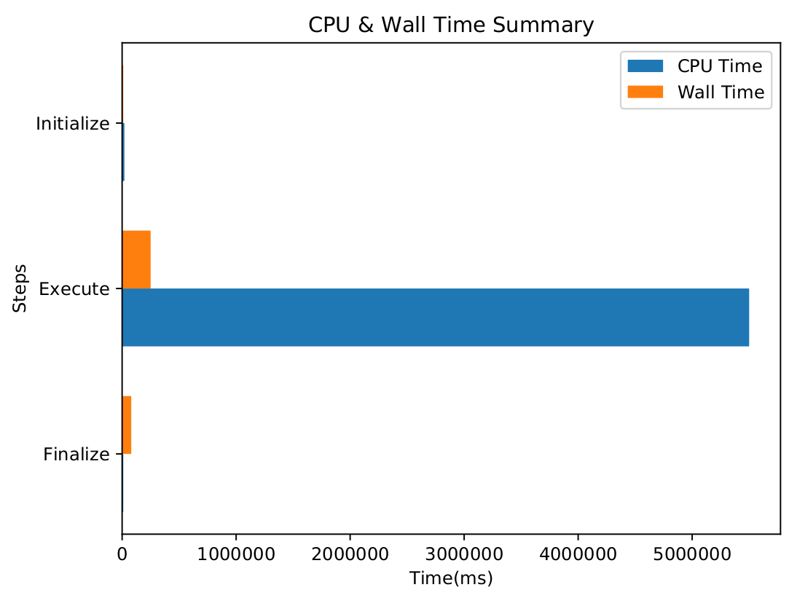

ATLAS is one of the four main experiments at the Large Hadron Collider(LHC) at CERN. Athena is the main software framework of ATLAS that manages almost all ATLAS bulk production workflows. It is based on the common [Gaudi framework](http://gaudi.web.cern.ch/gaudi/) that is used by ATLAS, LHCb and FCC experiments. Athena was originally designed as a single-threaded software framework and then upgraded to run in multi-process, AthenaMP. However, even AthenaMP was not a permanent solution to the increasing computing demand which comes with the expectations beyond Run2. Therefore, Athena is currently being upgraded to run in multi-threaded(MT) environment, namely AthenaMT. The main reason behind the migration from AthenaMP to AthenaMT is that memory is a limiting factor for ATLAS computing and the main difference between MP and MT is that the latter shares memory.

Performance of ATLAS code is very important in the sense that serving to ever-growing datasets within the constraints of limited computing resources. The current performance monitoring service has various shortcomings and needs an upgrade: It is only able to monitor single-threaded Athena jobs, hence it is not thread-safe. Besides, it uses the aspects of Athena/Gaudi that are going to be obsolete. In addition, it is hard to maintain and needs a clean-up. 
 
# Work Completed

Starting point in performance monitoring is to take snapshots at the beginning and at the end of a component, e.g. an algorithm, tool or service, which is desired to be monitored. We use before and after functions which are inherited from [Auditor](https://acode-browser1.usatlas.bnl.gov/lxr/source/Gaudi/GaudiKernel/GaudiKernel/Auditor.h#0034) class of Gaudi framework for this purpose.

A component of a typical AthenaMT job has following standard steps: Initialize, Start, Execute, Stop and Finalize. Events are processed in execute steps and execute step is run in multi-threaded environment in AthenaMT whereas other steps are executed serialy. We have monitored serial and parallel steps separately due to their different kind of execution.

### CPU & Wall Time Monitoring

CPU & Wall Time are measured at different levels throughout the execution of the job. As a starting point, Initialize, Execute and Finalize steps are monitored as a whole. This gives a rough information about how much time these steps take compared to each other. In addition, one can compare the CPU & Wall time for the event loop and see at which degree concurrency is achieved.

We also present component level monitoring which gives much more detailed information. It is implemented separately for serial and parallel steps and presented separately as well. By looking at these results, one can see the CPU usage of each component and identify the bottlenecks accordingly for the job.

### Memory Monitoring

Currently, memory monitoring is implemented just for the serial steps. In the context of memory we measure **Virtual Memory(VMEM)**, **Resident Set Size (RSS)**, **Proportional Set Size (PSS)** and **Swap** size for each component. It is possible to list memory usage of components in a descending order and see which components use the memory the most using these statistics.

# Outputs

The collected measurements are reported to the user in various ways: First, an output log is printed to stdout. Secondly, all measurements are written to a json file. There is a python script which plots the measurements using this json file. Here are some example plots and a snippet of the output:

#### Memory Monitoring at Initialize Step

#### CPU & Wall Time Summary

#### CPU & Wall Time Monitoring in the Event Loop

Apart from basic measurements, some useful statistics such as **Number of events processed**, **Events per second** and **CPU usage per event** are also available in the output. Besides, system information including **CPU model** and **Number of cores** can be seen at the end of the output. One can make inferences on how much CPU is utilized and how much gain is obtained by multi-threaded execution using these results. 

# Testing & Verification

The old service is successful in monitoring serial steps and the measurements for these steps are tested with the old service. 
Total time passed in the event loop is verified with the result returned by **AthenaHiveEventLoopMgr**, the default ATLAS batch event loop manager. Detailed information on these tests could be found in this [presentation](https://indico.cern.ch/event/835550/contributions/3502557/attachments/1882410/3113511/PerfMonMTSvc_v5.pdf).

The memory monitoring results will be verified with the results of [PrMon](https://github.com/HSF/prmon)[1] which is another resource monitoring program developed by CERN scientists. Unlike our service(PerfMonMTSvc), prmon does not have a prior knowledge about the job that it monitors. Therefore it just measures the memory based on timestamps. Therefore our service should be configured to record the measurements by timestamps for comparison purposes.

# Shortcomings & Limitations

*   One should be aware of the shortcomings and the limitations of the service. Firstly, mutex locks are used in the implementation of monitoring the event loop which may lead to a performance decrease of job. The overhead due to these locks are found to be negligible for the example jobs. However, this mode mainly targets debugging and doesn't have to be used in the actual jobs. Event loop monitoring is made optional due to the usage of locks and this option can be set from the job options file.

*   Memory statistics are gathered from **/proc/** directory which is only mounted on UNIX-like operating systems. Therefore it's not possible to make memory monitoring on other operating systems. However in practice this is not really a big problem as Athena jobs are currently running on CentOS7 (or a Linux derivative for the foreseeable future).

*   Implementation of the event loop monitoring is based on the assumption that each event is run on a single thread entirely. As we see so far, this is the case for most of the jobs, however there may occur some problems with the usage of 3rd party algorithms if they create their own worker threads apart from Intel TBB which is the main library used in AthenaMT to enable multi-threading.

# Future Work

*   Firstly, the shortcomings must be alleviated and the limitations should be removed as much as possible. Afterwards, memory monitoring for event loop should be implemented.

*   It is critical to monitor disk usage, since generally reading/writing operations on disk are the ones which slow down the execution.

*   Dynamically allocated memory size could be added as a statistic to memory monitoring to identify the memory leaks etc. The old service uses [mallinfo](http://man7.org/linux/man-pages/man3/mallinfo.3.html) function to collect it, however it's deprecated and not MT-safe.

*   No performance monitoring tool is perfect, since the service itself uses CPU and memory which may affect the measurements. It should be investigated in detail how much overhead our service brings and this overhead should be minimized, although the service is coded by considering these issues.

* * *

# Related Links

#### Presentation

*   A detailed presentation about the project can be reached by this [link](https://indico.cern.ch/event/835550/contributions/3502557/attachments/1882410/3113511/PerfMonMTSvc_v5.pdf)

#### Merge Requests

*   I have submitted 2 merge requests including all my work throughout the summer. Both of them were merged and they can be seen using these links: [MR1](https://gitlab.cern.ch/atlas/athena/merge_requests/25237),  [MR2](https://gitlab.cern.ch/atlas/athena/merge_requests/25790)

#### Source Code

*   Here are the links to the all classes written for this project:

| Header Files        | Code Files          | Scripts | Job Option Files |
|:--------------------|:--------------------|:--------|:-----------------|
| [PerfMonMTAuditor.h](https://gitlab.cern.ch/atlas/athena/blob/master/Control/PerformanceMonitoring/PerfMonComps/src/PerfMonMTAuditor.h)  | [PerfMonMTAuditor.cxx](https://gitlab.cern.ch/atlas/athena/blob/master/Control/PerformanceMonitoring/PerfMonComps/src/PerfMonMTAuditor.cxx)   | [PerfMonMTSvc_plotter.py](https://gitlab.cern.ch/atlas/athena/blob/master/Control/PerformanceMonitoring/PerfMonComps/scripts/PerfMonMTSvc_plotter.py)  | [PerfMonMTSvc_jobOptions.py](https://gitlab.cern.ch/atlas/athena/blob/master/Control/PerformanceMonitoring/PerfMonComps/share/PerfMonMTSvc_jobOptions.py)   |
| [PerfMonMTSvc.h](https://gitlab.cern.ch/atlas/athena/blob/master/Control/PerformanceMonitoring/PerfMonComps/src/PerfMonMTSvc.h)  | [PerfMonMTSvc.cxx](https://gitlab.cern.ch/atlas/athena/blob/master/Control/PerformanceMonitoring/PerfMonComps/src/PerfMonMTSvc.cxx)  |   | [MTJobOptCfg.py](https://gitlab.cern.ch/atlas/athena/blob/master/Control/PerformanceMonitoring/PerfMonComps/python/MTJobOptCfg.py)   |
| [PerfMonMTUtils.h](https://gitlab.cern.ch/atlas/athena/blob/master/Control/PerformanceMonitoring/PerfMonComps/src/PerfMonMTUtils.h)  |   |   |    |

# Final Words & Acknowledgements

It has been a great summer for me. I would like to thank mentors Davide Costanzo, James Catmore and especially Alaettin Serhan Mete for his continuous support throughout the coding period. I look forward to continue to contribute to the project and see future challenges!

* * *
[1]  Seuster, R., Rauschmayr, N., Limosani, T., Stewart, G., & Mete, A. S. (2019, February 4). HSF/prmon: v1.1.1. https://zenodo.org/record/2556701#.XVcm4vxRU5k

